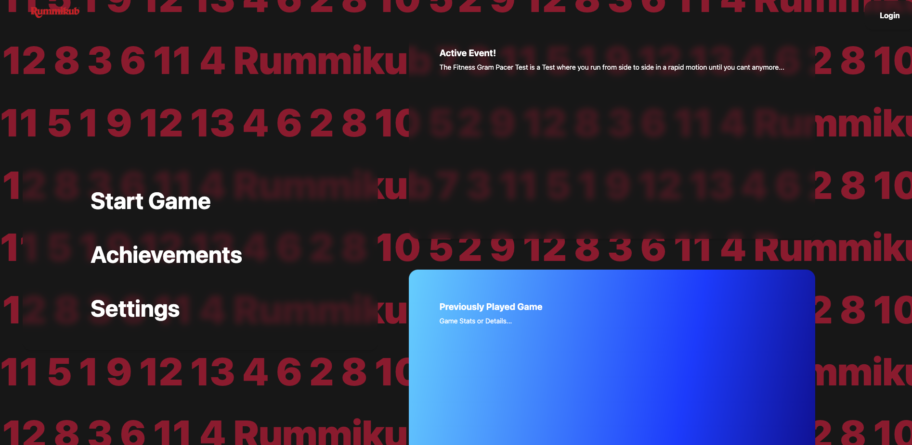

# Back-end

## Name

Rummikub Backend Service

## Description

This project is a backend service for a game application. It handles user management, game logic, matchmaking, 
and achievement assignment. The service is built using Java, Spring Boot, and Gradle, and it interacts with a SQL database 
to store game data and user information.


## Badges
* Pipelines:
https://gitlab.com/kdg-ti/integratieproject-2/2024-2025/team12/back-end/-/pipelines

* Test Coverage:
https://kdg-ti.gitlab.io/-/integratieproject-2/2024-2025/team12/back-end/-/jobs/8771848251/artifacts/build/jacocoHtml/index.html

## Visuals



## Installation

To install and run the project locally, follow these steps:

1. Clone the repository:
   ```sh
   git clone https://gitlab.com/kdg-ti/integratieproject-2/2024-2025/team12/back-end.git
      ```   
2. Build the project using Gradle:  
./gradlew build


3. Run the application:  
./gradlew bootRun or press the run button in your IDE

4. The docker compose file in the infrastructure map should be running

5. Make the "test" user with password test in keycloak


### Requirements
Java 21
The docker compose file in the infrastructure map should be running

## Usage

To use the API endpoints of the application in the http tests, the application should be running 
and you always get a token from the first endpoint above in the file from keycloack.
If you want to run all the tests at once you dont need to have anything up because the tests run in a container of their own.

## Roadmap

* Implement additional game features
* Add more achievements and rewards
* Enhance security and performance

## Contributing

We welcome contributions! Please fork the repository and submit a pull request. 
Make sure to follow the coding standards and include tests for your changes.

## Running tests
To run the tests, use the following command:
```sh
./gradlew test
```
there is also gitlab ci/cd that runs the tests automatically in the pipelines in gitlab
and sends reports of everything to the artifacts.
## Authors

* Chahid Ahdour
* Lewis Ion
* Yannick Vandenbulcke
* Jarno Fret


## Project status

Not all issues for the application have been implemented these will be
carried on to the next sprint.
